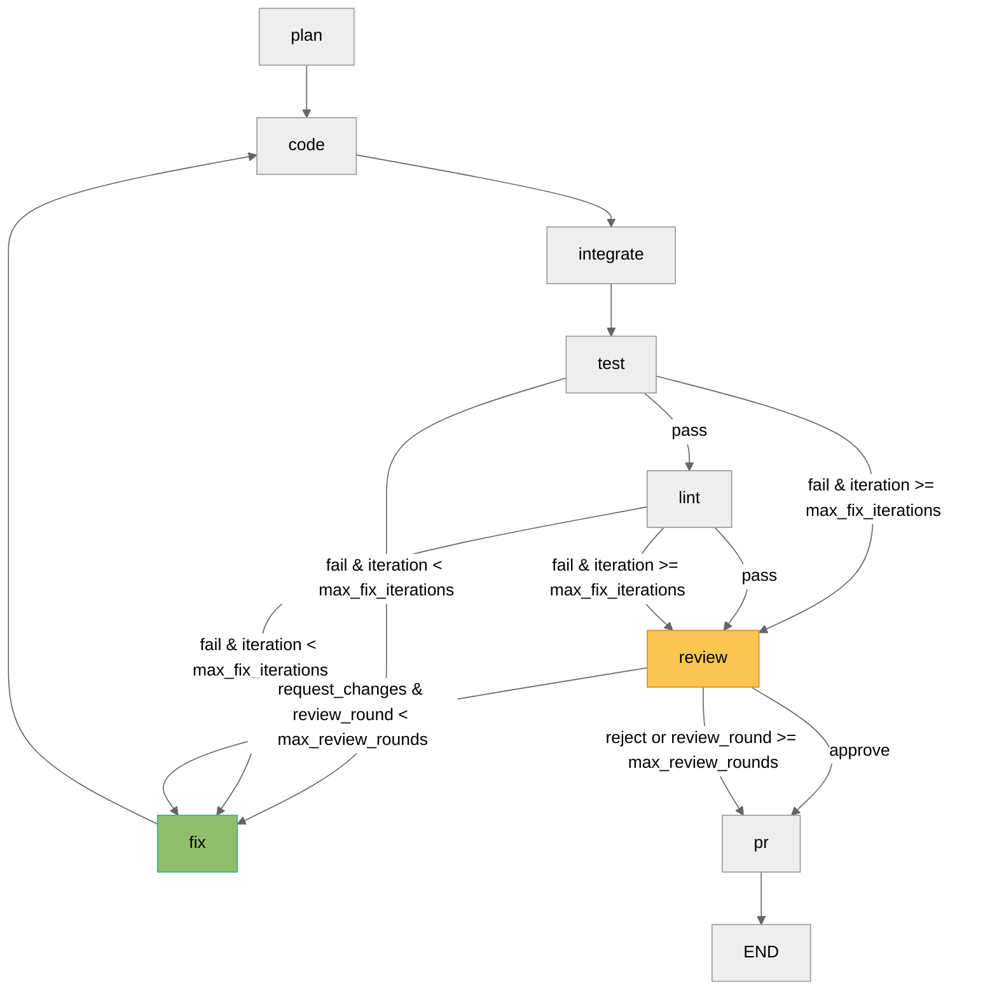
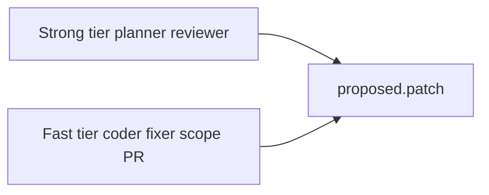

# Go OSS Agentic Contributor

`go-agent` is an agentic pipeline for approved Go open source repositories. Given a GitHub issue, it clones the repo, builds context, plans a fix, generates patches, runs tests and lint in a closed loop, reviews the change, and writes a PR summary (optionally opening a draft PR). Each run stores reproducible artifacts under `artifacts/{run_id}/`.

## Approved repositories

Only these four targets are allowed. Each has a repo skill under `skills/`; unknown repos fall back to [`skills/_default/SKILL.md`](skills/_default/SKILL.md).

| Repository | Skill file | Notes |
|------------|------------|-------|
| [gin-gonic/gin](https://github.com/gin-gonic/gin) | `skills/gin-gonic__gin/SKILL.md` | Default branch `master` |
| [spf13/cobra](https://github.com/spf13/cobra) | `skills/spf13__cobra/SKILL.md` | Default branch `main` |
| [go-playground/validator](https://github.com/go-playground/validator) | `skills/go-playground__validator/SKILL.md` | Module path ends in `/v10` |
| [golangci/golangci-lint](https://github.com/golangci/golangci-lint) | `skills/golangci__golangci-lint/SKILL.md` | Module path ends in `/v2`; large test suite |

## Prerequisites

- **Python 3.11+**
- **Go toolchain** matching the target repo (several approved repos require Go 1.25+)
- **`gh` CLI** for issue fetch and optional PR creation (`gh auth login` or `GITHUB_TOKEN`)
- **`git`** and **`rg`** (ripgrep) on your PATH
- **Optional:** `golangci-lint` when the repo skill or default lint path runs it
- **LLM API key:** at least one provider key (OpenAI, Anthropic, Groq, xAI, Gemini, or Nvidia NIM); planner, coder, and reviewer require an LLM

## Setup

```bash
python -m venv .venv && source .venv/bin/activate
pip install -e ".[dev]"

cp .env.example .env
# Edit .env: LLM keys, optional GITHUB_TOKEN, GO_AGENT_LOG_LEVEL

# Dry run (no push, no PR)
go-agent run --repo gin-gonic/gin --issue 1234 --dry-run

# Full run with draft PR
go-agent run --repo spf13/cobra --issue 567 --create-pr
```

Optional semantic retrieval: `pip install -e ".[rag]"` then pass `--rag` on `go-agent run`.

## Configuration

All settings load from environment variables (with optional `.env`). Variables prefixed with `GO_AGENT_` map to fields in [`src/go_agent/config.py`](src/go_agent/config.py). See [`.env.example`](.env.example) for a starter file.

### LLM and GitHub

| Variable | Required | Default | Purpose |
|----------|----------|---------|---------|
| `OPENAI_API_KEY` | One LLM key | (none) | OpenAI via LiteLLM |
| `ANTHROPIC_API_KEY` | One LLM key | (none) | Anthropic via LiteLLM |
| `GROQ_API_KEY` | One LLM key | (none) | Groq via LiteLLM |
| `XAI_API_KEY` | One LLM key | (none) | xAI via LiteLLM |
| `GEMINI_API_KEY` | One LLM key | (none) | Google Gemini via LiteLLM |
| `NVIDIA_NIM_API_KEY` | One LLM key | (none) | [Nvidia NIM](https://build.nvidia.com) via LiteLLM (`nvidia_nim/` model prefix) |
| `NVIDIA_NIM_API_BASE` | No | `https://integrate.api.nvidia.com/v1` | Override NIM API base URL (no trailing slash) |

NIM model IDs use the catalog name with dashes, e.g. `nvidia_nim/meta/llama-3.1-8b-instruct` (not `llama3-8b`). List IDs with `GET https://integrate.api.nvidia.com/v1/models`.
| `GO_AGENT_MODEL_FAST` | No | `gpt-4o-mini` | Coder, fixer, scope hints, PR draft |
| `GO_AGENT_MODEL_STRONG` | No | `gpt-4o` | Planner and reviewer |
| `GO_AGENT_LLM_MAX_RETRIES` | No | `3` | Retries on rate limits |
| `GO_AGENT_LLM_RETRY_BASE_DELAY` | No | `1.0` | Base delay (seconds) for backoff |
| `GITHUB_TOKEN` | For API fetch | (none) | Alternative to `gh auth login` |

### Pipeline and paths

| Variable | Default | Purpose |
|----------|---------|---------|
| `GO_AGENT_WORK_DIR` | `./workspaces` | Cloned repos per run |
| `GO_AGENT_ARTIFACTS_DIR` | `./artifacts` | Logs, JSON artifacts, checkpoints |
| `GO_AGENT_LOG_LEVEL` | `INFO` | `DEBUG`, `INFO`, `WARNING`, or `ERROR` |
| `GO_AGENT_MAX_FIX_ITERATIONS` | `5` | Test/lint fix loop cap |
| `GO_AGENT_MAX_REVIEW_ROUNDS` | `1` | Review `request_changes` fix cycles |
| `GO_AGENT_TEST_TIMEOUT` | `300` | Subprocess test timeout (seconds) |
| `GO_AGENT_LINT_TIMEOUT` | `120` | Subprocess lint timeout (seconds) |
| `GO_AGENT_MAX_ISSUE_COMMENTS` | `20` | Issue comments loaded for context |

### Context bundle

| Variable | Default | Purpose |
|----------|---------|---------|
| `GO_AGENT_CONTEXT_MAX_CHARS` | `80000` | Total char budget for ranked files |
| `GO_AGENT_CONTEXT_MAX_FILES` | `15` | Max files in the bundle |
| `GO_AGENT_CONTEXT_GRAPH_MAX_HOPS` | `2` | Code graph expansion depth |
| `GO_AGENT_CONTEXT_SNIPPET_RADIUS` | `5` | Lines around ripgrep hits |
| `GO_AGENT_CONTEXT_FULL_FILE_TOP_K` | `3` | Top files loaded in full |
| `GO_AGENT_CONTEXT_SUMMARY_TOP_K` | `5` | Files summarized by LLM |

### Coder and search

| Variable | Default | Purpose |
|----------|---------|---------|
| `GO_AGENT_CODER_MAX_FILE_CHARS` | `60000` | Max file size sent to coder |
| `GO_AGENT_CODER_MAX_WORKERS` | `4` | Parallel coder workers |
| `GO_AGENT_INTEGRATOR_MAX_MERGE_RETRIES` | `1` | Integrator LLM retries |
| `GO_AGENT_RIPGREP_TIMEOUT` | `30` | Ripgrep subprocess timeout |
| `GO_AGENT_RIPGREP_MAX_RESULTS` | `50` | Max search hits |
| `GO_AGENT_REPO_MAP_MAX_DEPTH` | `4` | Repo tree walk depth |

### Optional RAG

Enable with `GO_AGENT_ENABLE_RAG=true` and `pip install -e ".[rag]"`.

| Variable | Default | Purpose |
|----------|---------|---------|
| `GO_AGENT_RAG_TOP_K` | `10` | Semantic hits merged into search |
| `GO_AGENT_RAG_CHUNK_LINES` | `80` | Embedding chunk size |
| `GO_AGENT_RAG_CHUNK_OVERLAP` | `20` | Chunk overlap |
| `GO_AGENT_RAG_EMBED_PROVIDER` | `local` | `local` or `openai` |
| `GO_AGENT_RAG_EMBED_MODEL` | `all-MiniLM-L6-v2` | Local embed model name |
| `GO_AGENT_RAG_MIN_SCORE` | `0.3` | Minimum similarity score |

## Usage

### `go-agent run`

```bash
go-agent run --repo <owner/name> --issue <N> [options]
```

| Flag | Description |
|------|-------------|
| `--repo` | Approved repository (required) |
| `--issue` | GitHub issue number (required) |
| `--dry-run` | Skip push and PR create (default) |
| `--create-pr` | Push branch and open draft PR via `gh` |
| `--force` | Run on closed issues |
| `--rag` | Enable semantic retrieval for context |
| `--patch-file` | Apply an existing patch instead of LLM coding |

The CLI clones the repo, fetches the issue, builds scope and context, creates branch `agent/issue-{N}-{slug}`, then runs the LangGraph closed loop. Outputs land in `artifacts/{run_id}/`.

Key artifacts: `plan.json`, `proposed.patch`, `test_result.json`, `lint_result.json`, `review.json`, `PR.md`.

### `go-agent resume`

If a run is interrupted, resume from the last LangGraph checkpoint:

```bash
go-agent run --repo gin-gonic/gin --issue 1234 --dry-run
# Note run_id from logs or artifacts/{run_id}/

go-agent resume --run-id <run_id>
```

- **Checkpoint DB:** `artifacts/checkpoints/checkpoints.db` (or `{GO_AGENT_ARTIFACTS_DIR}/checkpoints/`)
- **Thread ID:** the run UUID
- **Requirements:** `workspaces/{run_id}/repo` and `artifacts/{run_id}/` must still exist
- **Already complete:** exit code 2 if the graph finished
- **Overrides:** `--dry-run` / `--create-pr` can override values from `run_meta.json`

### Review output

After tests and lint pass, the review agent writes `review.json` with `decision` (`approve`, `request_changes`, or `reject`), `comments[]`, and a checklist. The reviewer sees `gofmt -d` and vet findings. On `request_changes`, the graph runs one fix cycle by default (`GO_AGENT_MAX_REVIEW_ROUNDS=1`); a second failure sets `status=failed` with the review attached.

## Architecture

Closed-loop routing (LangGraph):



LLM tiers by stage:



**Full design:** [docs/ARCHITECTURE.md](docs/ARCHITECTURE.md)


## Evaluation

Sample end-to-end dry-run against [validator#1348](https://github.com/go-playground/validator/issues/1348): the pipeline ran plan → code → integrate → five fix loops → review → PR draft. Tests did not pass within the iteration cap; see the post-mortem for root cause, artifacts, and follow-up options.

**Details:** [docs/EVALUATION.md](docs/EVALUATION.md) — includes checked-in artifacts under [`samples/f3934252-659f-48b2-a936-765c7e7869dd/`](samples/f3934252-659f-48b2-a936-765c7e7869dd/).

## Repository layout

```
pocket-fm-assignment/
  src/go_agent/          # CLI, agents, orchestrator, runners
    cli.py
    planner.py coder.py reviewer.py fixer.py
    orchestrator/        # LangGraph graph and nodes
    skills.py            # Repo skill loading
  skills/                # Per-repo SKILL.md + _default
  docs/
    ARCHITECTURE.md
    EVALUATION.md
    FEATURE_MAP.md
  samples/
    f3934252-659f-48b2-a936-765c7e7869dd/   # validator #1348 dry-run artifacts
  tests/
  artifacts/             # Run outputs (gitignored)
  workspaces/            # Cloned repos (gitignored)
```

## Limitations

- Only the four approved repositories above can be cloned; others are rejected at startup.
- The planner, coder, and reviewer require LLM keys. Plan generation does not fall back to heuristics.
- Fix loops cap at `GO_AGENT_MAX_FIX_ITERATIONS` (default 5). Review-driven fixes cap at `GO_AGENT_MAX_REVIEW_ROUNDS` (default 1).
- Context is bounded (about 80k characters and 15 files by default). Large issues may omit peripheral code.
- The agent does not auto-merge. `--create-pr` opens a draft PR through `gh`; you review and merge manually.
- Work stays isolated under `workspaces/{run_id}/`. The tool does not force-push to upstream default branches.
- Full `golangci-lint` test suites can be slow, especially on `golangci/golangci-lint`.
- RAG and Mem0 are optional extras. The core path does not require them.

## Cost and token notes

There is no built-in billing meter. Cost follows your provider rates for `GO_AGENT_MODEL_FAST` and `GO_AGENT_MODEL_STRONG`.

| Stage | Model tier | What drives token usage |
|-------|------------|-------------------------|
| Planner | strong | Issue body, context bundle (up to 80k chars), repo skill |
| Coder | fast | One prompt per planned file (up to 60k chars each), parallel waves |
| Fix loop | fast | Retries up to max fix iterations with test/lint/review output |
| Reviewer | strong | Patch diff, test/lint output, skill truncated to 2k chars |
| Scope / PR | fast | Smaller enrichment prompts |

For a typical single-file fix on gin with one fix cycle, expect on the order of **50k to 200k input tokens**, depending on bundle size, number of files, and retries. To control cost:

- Run with `--dry-run` first.
- Pick focused issues and smaller repos when experimenting.
- Lower `GO_AGENT_CONTEXT_MAX_CHARS` or `GO_AGENT_CONTEXT_MAX_FILES`.
- Use a cheaper fast model for coding while keeping a capable strong model for plan and review.

## Development

```bash
pytest -q && ruff check src tests
```

## License

MIT (assignment submission)
