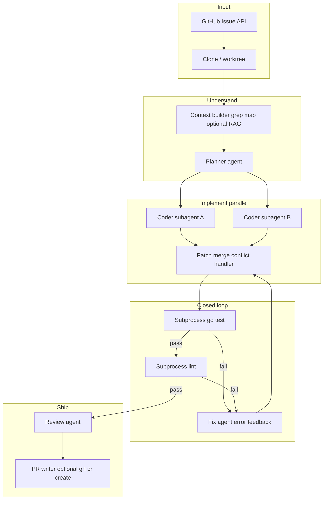
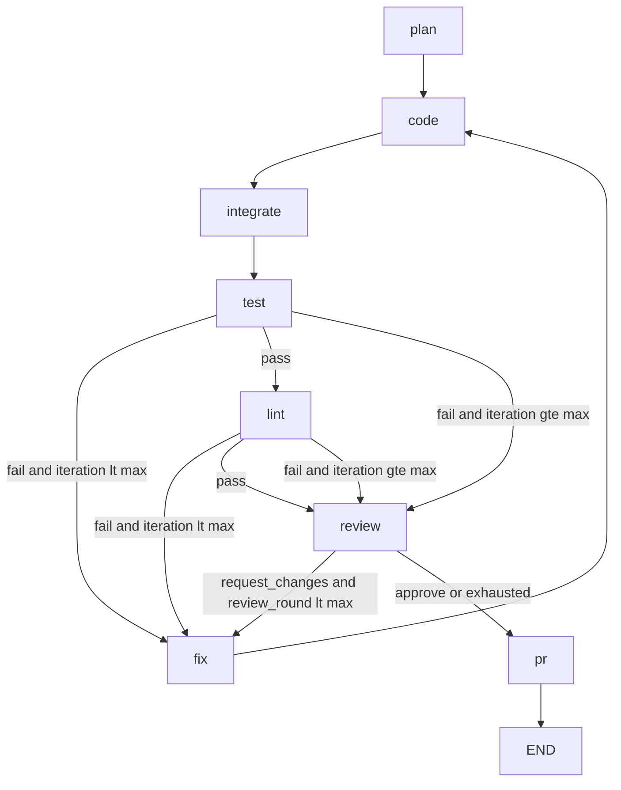
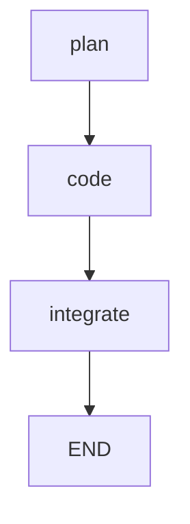
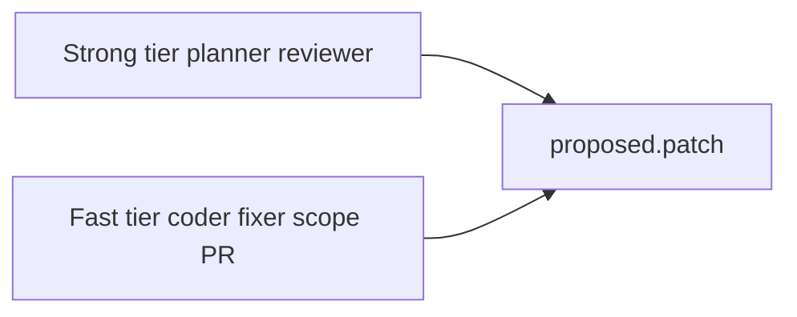

# Architecture

Operator setup (install, env vars, usage): see [README](../README.md).

## End-to-end flow

```mermaid
flowchart TB
  subgraph input [Input]
    GH[GitHub Issue API]
    CLONE[Clone / worktree]
  end

  subgraph understand [Understand]
    CTX[Context builder grep map optional RAG]
    PLAN[Planner agent]
  end

  subgraph implement [Implement parallel]
    C1[Coder subagent A]
    C2[Coder subagent B]
    MERGE[Patch merge conflict handler]
  end

  subgraph validate [Closed loop]
    TEST[Subprocess go test]
    LINT[Subprocess lint]
    FIX[Fix agent error feedback]
  end

  subgraph ship [Ship]
    REV[Review agent]
    PR[PR writer optional gh pr create]
  end

  GH --> CLONE --> CTX --> PLAN
  PLAN --> C1 & C2 --> MERGE
  MERGE --> TEST
  TEST -->|fail| FIX --> MERGE
  TEST -->|pass| LINT
  LINT -->|fail| FIX
  LINT -->|pass| REV --> PR
```

## Closed-loop graph

```mermaid
flowchart TB
  plan --> code
  code --> integrate
  integrate --> test
  test -->|"fail and iteration lt max"| fix
  test -->|pass| lint
  test -->|"fail and iteration gte max"| review
  lint -->|"fail and iteration lt max"| fix
  lint -->|pass| review
  lint -->|"fail and iteration gte max"| review
  fix --> code
  review -->|"request_changes and review_round lt max"| fix
  review -->|approve or exhausted| pr
  pr --> endNode["END"]
```

## Implement-only graph

```mermaid
flowchart TB
  plan --> code
  code --> integrate
  integrate --> endImplement["END"]
```

## LLM tiers by stage

```mermaid
flowchart LR
  strong[Strong tier planner reviewer]
  fast[Fast tier coder fixer scope PR]
  strong --> patch[proposed.patch]
  fast --> patch
```
