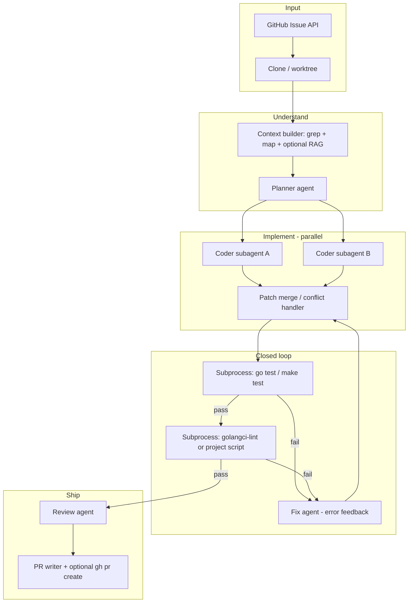
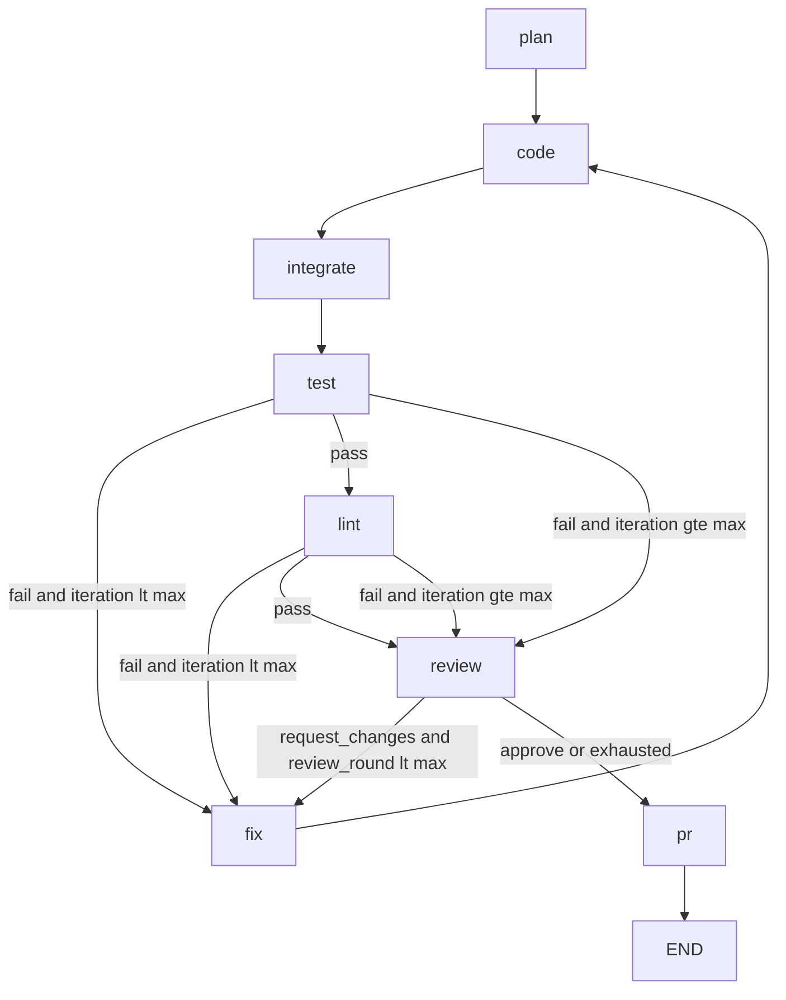
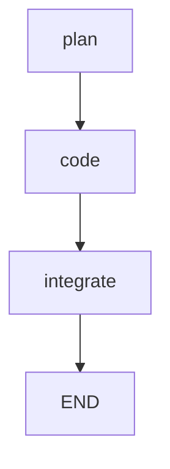

# Architecture: Agentic Go OSS Contributor

Operator setup (install, env vars, usage): see [README](../README.md).

## Goals (from assignment)

1. Ingest a GitHub issue from an approved repo
2. Understand repo + issue → plan → edit code
3. Run Go tests/checks in a **closed loop** until pass or max iterations
4. Review for conventions
5. Output branch/diff + PR title/body (optional: open PR)

Non-goals: production autonomy, huge refactors, security-sensitive auto-merge.

---

## High-level flow



---

## Why LangGraph over CrewAI (for this project)

| | LangGraph | CrewAI |
|---|-----------|--------|
| **Test-fix cycle** | First-class graph edges and conditional routing | Possible via tasks/process, but less explicit |
| **State** | Typed state object passed between nodes | Task outputs; more stringly |
| **Speed** | You control parallelism (map over files) | Crew coordination adds latency |
| **Debuggability** | Graph visualization, checkpoints | Harder to trace multi-task flows |
| **Assignment fit** | “Thoughtful framework” with clear control flow | Good for demos; easier to become opaque |

**Recommendation:** Use **LangGraph** as the orchestrator. You can still model a “crew” as named nodes (Planner, Coder-1, Coder-2, Reviewer) without CrewAI’s framework.

**When CrewAI is fine:** If you already know CrewAI well and implement an explicit `while not tests_passed` process with subprocess tools, it can satisfy the assignment. Prefer LangGraph if starting fresh.

---

## Memory: Mem0 vs alternatives

| Approach | Use when | Tradeoff |
|----------|----------|----------|
| **No Mem0 — repo index + run artifacts** | Default for take-home | Simple, reproducible, matches “one issue per run” |
| **LangGraph SqliteSaver** | Resume failed runs, audit trail | Built-in, no extra service |
| **SQLite + local embeddings (Chroma/LanceDB)** | RAG over codebase across steps | Full control, offline |
| **Mem0** | Many issues on same repo; learn maintainer preferences | Extra API/key; harder for reviewers to reproduce |
| **Redis** | Team dashboard / multi-worker | Overkill for solo assignment |

**Recommendation:** Start with **repo-local index** (file tree, `go doc`, ripgrep hits, optional embeddings of top-k files) + **per-run JSON** under `artifacts/<run_id>/`. Add Mem0 only in a late milestone if you want cross-issue memory.

---

## Agent roles (team-based, not one-shot)

### 1. Planner
- **Input:** issue title/body, labels, linked PRs/comments (optional), repo map, grep for symbols from issue text
- **Output:** structured plan JSON: `files_touched`, `approach`, `test_commands`, `risks`

### 2. Coder subagents (parallel, fast)
- Partition plan by **file or package**; each subagent gets narrow context (target file + imports + related tests)
- **Tools:** read_file, search_repo, apply_patch (unified diff or search-replace blocks)
- **Output:** patches only; no PR prose

### 3. Integrator (lightweight node)
- Apply patches sequentially; on conflict, escalate to single “merge” coder pass

### 4. Validator (subprocess, not LLM)
- `go test ./...` or scoped package from plan
- Project-specific: `make test`, `task test`, `.github/workflows` hints from skills
- Capture **stdout/stderr** → state for fix loop

### 5. Fix agent
- **Input:** test/lint failures + last diff
- **Output:** corrective patch; increment `iteration` (cap e.g. 5)

### 6. Review agent
- Checklist: API stability, error handling, naming, tests added, issue acceptance criteria
- Can use **static tools**: `go vet`, `gofmt -d`, golangci-lint
- **Output:** `approve | request_changes` + comments; one more fix cycle if `request_changes`

### 7. PR agent
- Title/body from issue + plan + diff stat + test output
- Optional: `gh pr create` with draft flag

---

## Closed-loop state machine

The **conceptual** end-state includes parallel coders, an integrator node, and a separate lint step. Those are implemented in the imperative CLI today (`coder.py`, `integrator.py`) and will be wired into LangGraph in later issues.

The **implement graph** (default CLI path) lives in `go_agent.orchestrator` (see [LangGraph orchestrator (code)](#langgraph-orchestrator-code) below). CLI performs clone, issue fetch, context bundle, and branch creation **before** invoking the graph. State is defined in `orchestrator/state.py`:

```python
# AgentState (TypedDict) + Pydantic sub-models TestResult, ReviewResult
class AgentState(TypedDict, total=False):
    run_id: str
    repo: str
    issue_number: int
    status: Literal["planning", "coding", "testing", "fixing", "reviewing", "shipping", "done", "failed"]
    iteration: int
    last_node: str
    test_result: dict[str, Any]   # TestResult.model_dump()
    review: dict[str, Any]        # ReviewResult.model_dump()
    error: str | None
```

Conceptual edges (full system, not all nodes in stub graph yet):

- `plan` → `code` (parallel map) → `integrate` → `test`
- `test` → `fix` if fail and iteration < max → `integrate`
- `test` → `lint` if pass
- `lint` → `fix` if fail …
- `lint` → `review` → `fix` OR `pr` → END

---

## LangGraph orchestrator (code)

Module: [`src/go_agent/orchestrator/`](../src/go_agent/orchestrator/)

**Wired nodes:** `plan`, `code`, `integrate`, `test`, `lint`, `fix`, `review`, `pr`. CLI invokes `compile_graph(include_test=True, include_closed_loop=True)` after setup and branch creation.

**Validation-only graph** (`include_test=True`, `include_closed_loop=False`): test → lint (if pass) → END; used in fast offline tests.

Default closed-loop graph (CLI):



Legacy implement-only graph (`implement_only=True`):



Routing from `test`:

| Condition | Next node |
|-----------|-----------|
| `test_result.passed` is true | `lint` |
| failed and `iteration < max_fix_iterations` | `fix` |
| failed and `iteration >= max_fix_iterations` | `review` (status `failed`) |

Routing from `lint`:

| Condition | Next node |
|-----------|-----------|
| `lint_result.passed` is true | `review` |
| failed and `iteration < max_fix_iterations` | `fix` |
| failed and `iteration >= max_fix_iterations` | `review` (status `failed`) |

Routing from `review`:

| Condition | Next node |
|-----------|-----------|
| `review.decision == approve` | `pr` |
| `request_changes` and `review_round < max_review_rounds` | `fix` |
| `reject` or exhausted `request_changes` | `pr` (status `failed`) |

`fix` calls the fix agent ([`fixer.py`](../src/go_agent/fixer.py)), increments `iteration`, writes `fix_meta.json`, then returns to `code`. Fix-loop cap uses `GO_AGENT_MAX_FIX_ITERATIONS` (default 5). Review-driven fixes use review comments as failure context; cap uses `GO_AGENT_MAX_REVIEW_ROUNDS` (default 1).

### Fix agent

Module: [`src/go_agent/fixer.py`](../src/go_agent/fixer.py)

- Consumes `test_result` / `lint_result` output, lint `file:line` findings, or review `comments[]` when `failure_source=review`
- Generates corrective patches via fast-tier LLM (reuses coder patch pipeline)
- Writes `fix_meta.json` with iteration, failure source, and error summary

### Test runner

Module: [`src/go_agent/test_runner.py`](../src/go_agent/test_runner.py)

- Reads `test_commands` from `plan.json` via `resolve_test_commands()` in [`skills.py`](../src/go_agent/skills.py)
- Repo skill override: YAML frontmatter `test_commands:` in `skills/{owner__repo}/SKILL.md`, or first ` ```bash ` block containing `go test`
- Runs commands in the cloned repo with `GO_AGENT_TEST_TIMEOUT` (default 300s)
- Writes `artifacts/{run_id}/test_result.json` with per-command exit code, stdout/stderr, duration
- CLI exits **1** when tests fail before max iterations are exhausted, or when max fix iterations are exceeded (`status=failed`)

---

## MCP server (optional but strong differentiator)

Expose tools so Cursor / Claude Desktop can use the same capabilities:

| Tool | Description |
|------|-------------|
| `repo_search` | ripgrep / symbol search |
| `repo_read` | read file with line range |
| `repo_map` | packages, go.mod summary |
| `run_go_test` | scoped subprocess |
| `run_lint` | golangci-lint or skill-defined |
| `github_get_issue` | fetch issue JSON |
| `github_create_pr` | branch + PR |

Implementation: Python `mcp` SDK or FastMCP; spawn from `mcp/server.py`.

---

## Project skills (per approved repo)

Under `skills/<repo_name>/SKILL.md`:

- How to run tests (from README / Makefile)
- Lint expectations
- Common patterns (e.g. gin middleware style, cobra command structure)
- **Do-not** rules (generated files, version bumps)

Loaded into planner + coder + reviewer system prompts.

---

## GitHub integration

1. **Fetch issue:** `GET /repos/{owner}/{repo}/issues/{number}` (PyGithub or `gh issue view --json`)
2. **Branch:** `agent/issue-{number}-{slug}`
3. **Commit:** conventional message `fix: ... (fixes #N)`
4. **PR:** body sections: Problem, Solution, Testing, Fixes #N

`--dry-run`: stop at `artifacts/` diff + `PR.md` without push.

---

## Speed tactics

- **Small context windows per coder subagent** (one package)
- **Cache** repo index after clone
- **Cheap model** for planner/reviewer; **strong model** only for fix loops after test failure
- **Parallel coders** only when plan lists disjoint files
- **Early exit** if `go test` on affected package passes before full `./...`

---

## Validation alignment (how reviewers will test you)

Your README should document running against e.g. gin issue #XXXX with:

```bash
go-agent run --repo gin-gonic/gin --issue XXXX --dry-run
diff -u artifacts/.../changes.patch expected.patch  # optional sample
```

Store **sample runs** under `samples/` (redacted tokens): plan.json, test.log, PR.md.

---

## Tech stack summary

```
Python 3.11+
  langgraph, langchain-core (minimal), litellm, typer, pydantic
  pygithub, gitpython, httpx
  ripgrep (rg) via subprocess
Go toolchain (for target repos)
gh CLI
Optional: chromadb, mem0ai
```

---

## Risk controls

- Max iterations / token budget per run
- Allowlist repos (four approved only)
- No `rm -rf`, no force-push main
- Sandbox: work in `workspaces/{run_id}/` only
- Human-readable logs in `artifacts/`
